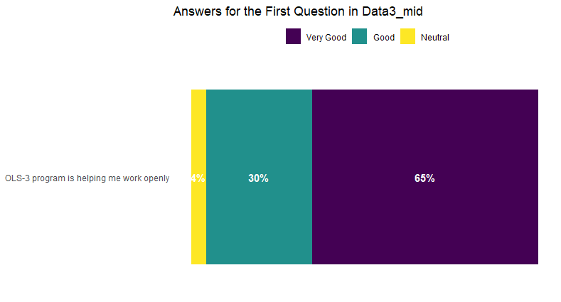

Hello to you all dear OLS organizers! I wanted to summarize my project ones more and wanted to add my comments and the things that I couldn’t compress within the presentation.

## 1.RESULTS

### 1.1 Graphs

First of all, I can start with the graphs and summarize here again;

**Graph 1 // Mentee Middle Cohort**

**Question 1:** OLS-3 program is helping me working openly

 

- 65% of the participants answered this question as very good. While 30% said good and only 4% answered as neutral. Although this question was answered with numbers (like out of 5), to be able to make a graph, I transformed that to very good, good and neutral.

**Graph 2 // Mentee Middle Cohort**

**Question 4 (Multiple Selection, *n=23*)**

-	According to the results, “Talks by the guest speakers”, “Information before and after the call” and “Shared note-taking on the google doc” are the best three aspects that are liked by the mentees. Even others have the high percentages too. However, among them “Written breakout room activities” has the least percentages with 26.1%.

**Graph 3 // Mentee Middle Cohort**

**Question 5 *(n=23)***

-	Actually, the results of Graph 2 and Graph 3 are compatible with each other. Because in here also, mentees selected the “Breakout room activities” as should be improved with 30.4%. However, other results are not looking very alike with the Graph 2. In here, “Opportunity to get to know others”, “Shared note-taking on the google doc” and “Information on before, during and after call” are also selected as can be improved with 21.7% in each. 

**Graph 4 // Mentee Middle Cohort**

**Question 8 (Multiple Selection, *n=23*)**

-	Mentees are thinking “Weekly emails from the organizers” is the best effective communication way with 91% and “Google groups for tracking weekly information” is the least effective with 17%.

**Graph 5 // Mentor Middle Cohort**

**Question 9 (Multiple Selection, *n=22*)**

-	Mentors are thinking “Slack channels to connect with others” is the best effective communication way with 81.8% and “Google groups for tracking weekly information” is the least effective one with 4.5%. 
-	In my opinion, the differences between graph 4 and 5 are due to the usage purposes. Since we, mentees, are depending on the mails from you, selection of “Weekly emails from the organizers” option is not that surprising. Similarly, best communication way for the mentors is “Slack channels to connect with others”. Also, “Weekly emails from the organizers” has high percentages in here too. However, for both groups, “Google groups for tracking weekly information” is the least effective one.

**Graph 6 // Mentee Post Cohort**

**Question 3:** How was your overall experience with the mentor-mentee calls (this does not include cohort calls)? (n=35)

-	While 74% of the mentees are thinking it as “always useful”, 20% is answered as “mostly useful” and 6% are said “somewhat useful”.

**Graph 7 // Mentor Post Cohort**

**Question 3 :** How was your overall experience with the mentoring calls with your mentee? *(n=26)*

-	While 40% of the mentors are thinking it as “always constructive”, 23% is answered as “mostly constructive” and 11% is said “somewhat constructive”. 

**Graph 8 // Mentee Post Cohort**

**Question 1 *(n=35)***

-	While 66% of the mentees are achieved “Most” of their goals, Achieving “All” goals and “Partialy” working on the project have 17% for each. 

**Graph 9 // Mentor Post Cohort**

**Question 1 (Multiple Selection, *n=26*)**

-	While 92% of the mentors are feeling “supported and training offered in OLS3 was adequate”, 58% of them enjoyed “their participation and did not find the experience overwhelming”.

### 1.2 Open Questions & Comments

 This section is about the answers that I checked by myself, like the comments that they made as an extra. Maybe it could have been done by R also, but due to lack of knowledge, I will add like this 😊
 
 For mentees; 
-  They were all happy to participate in this program and all of them (except just one) will recommend this program to other people. 

For mentors; 

- Overall, they all felt supported during the OLS-3 journey with a great organization. 
- As an answer to “Can you think of a topic that we did not share in our program with the cohort members and mentors that could be useful for Open Science projects and leaders?”, they suggested several topics. These topics do not have higher percentages but I try to gather them under similar topics which are;
  - Project Financing & Grant  
  - Handling failure of a project or funding runout, Negative aspects
  - Strategies/extension of road mapping
- Some mentors have mentioned mentee problems like their attendance during the calls. 
- Also, some mentors asked for an evaluation of their mentee’s projects (Feedbacks by the organizers to mentors).
- They are all thinking this is an amazing program. In a way, while mentors are helping/teaching their mentees, mentors are also getting help/education as well. 
- General final comment; They are thinking the program is awesome and asking you to keep on working!

## 2. Personal Comments

I have to start with lots of compliments to the program and to you obviously! This is an amazing program and a huge opportunity for everyone. Gathering lots of people all around the world, giving them a chance to meet with others, getting advice from well-matched mentors, and supporting them throughout all the way are not the things that everyone can do. Therefore, on behalf of myself and for everyone (I am sure all will agree with me), ones more THANK YOU!

After analyzing the questions from the survey, I thought maybe you can add some complementary questions in both of the surveys (like both in middle & post). For example, the first question you have in the middle mentee survey which is “OLS-3 program is helping me working openly”, maybe the same question or similar to this one can be added into post-survey as well. I think if these kinds of questions are added, the progress during the program can be seen and how it changed throughout the program can be interpreted at the end. 

From the results of graphs 2 and 3, “Breakout room activities” can be examined again. Due to timing, I couldn’t attend most of the cohort calls. But the ones that I was able to attend were quite okay. Actually, I was surprised by how good they were. Maybe somehow, it was different than the OLS-3, I don’t know. 
From the results of graphs 4 and 5, “Google groups for tracking weekly information” are answered as the least effective way by both mentees and mentors.
In the evaluation of mentee & mentor calls, maybe a question like “what can be done to make them more effective?” can be added. In that way, for mostly and somewhat options, an answer can be gotten. Same for mentors too. They can add a comment for their most and somewhat constructive selections. 

Before applying to the program, when I saw the advertisement, I really hesitated to apply. Because even if I didn’t know what is open science, I was totally thinking this was something about programming or informatics or computer science, etc. I was sure like this is not for me. After lots of insistence that came from my friend, I looked deeply and saw your suggested topics. What I am trying to say is anyone who wants to work openly or learn open science can join the program, just like you said. Maybe, this part can be more emphasized in program advertisements. Like, regardless of their background, anyone can join (even if they don’t have any project in their mind).  
As of last, I think everyone should hear about this program for sure. Maybe just out of curiosity, we can ask the locations of mentors and mentees. Like which countries with which percentages. What can be done more to get participants from the countries that no one attended? 

Consequently, there will be always negative comments (hopefully as we learned constructive ones 😊), since we are all human beings, we can’t happy with everything, unfortunately. However, like I said before the things that you achieve and will continue to achieve are amazing. Thanks to you even I got a chance to learn programming (sometimes still can’t believe it!). For all of your support, kindness, and time, I really appreciated it. I know my conclusions are not the best (there is still a lot of things to learn). However, if they will help you, even it’s a little bit, I will be so happy. I wish you all the best for the future and please do not hesitate to contact me for anything. Maybe even in the future, we get a chance to work together again, hopefully, 😊.

